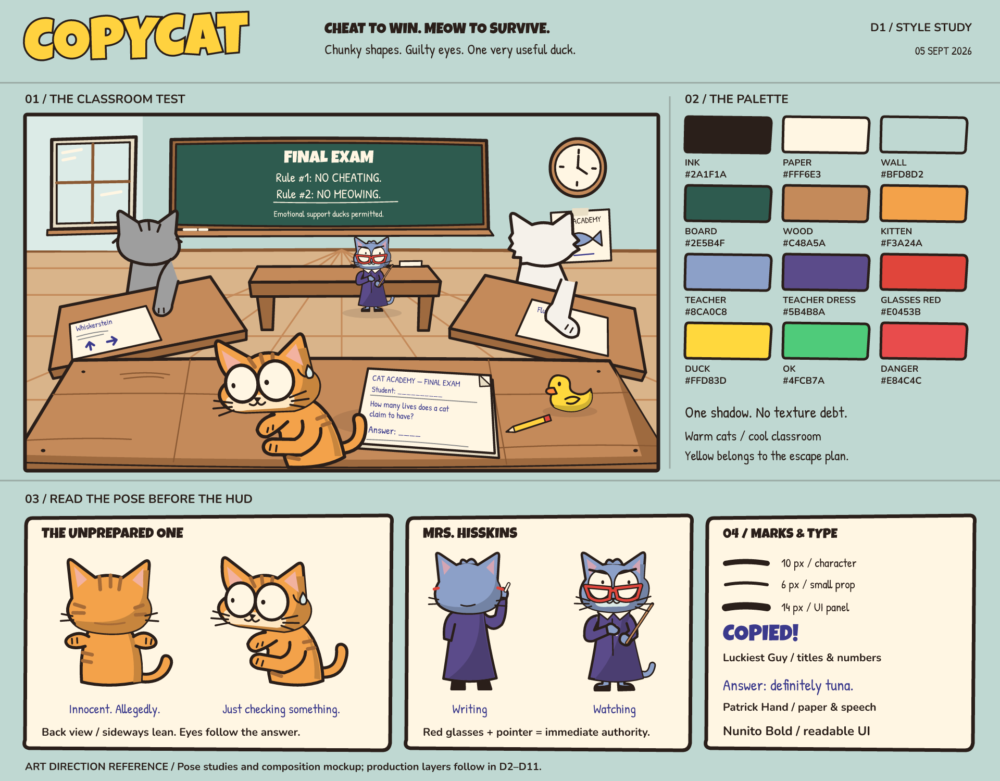

# COPYCAT / Art

## D5 — соседи

[Позы](previews/d5/pose_sheet.png) · [Слои](previews/d5/layer_sheet.png) · [Стыки и парты](previews/d5/motion_sheet.png) · [Закрыто](previews/d5/classroom_covered.png) · [Открыто](previews/d5/classroom_lifted.png) · [480×270](previews/d5/classroom_thumbnail.png)

`src/d5/` — 8 SVG и `rig.json`: тело, голова, лапа каждого соседа плюс общие `eye_white` и `pupil`. `exports/d5/` — 8 прозрачных PNG @2x и автономные SVG, `previews/d5/` — 6 проверочных PNG/SVG. `neighbours.mjs` подключён к общей сборке. `npm run check` сверяет все D1–D5 и запускает `check-neighbours.mjs`: связность силуэта тела/лапы при 111 значениях подъёма (0–110%) для каждого персонажа. Это проверка отсутствия отрыва; художественный стык/перекрытия дополнительно смотрим в motion sheet, runtime — в E3.

Whiskerstein — серый табби в круглых очках (оправа входит в голову), Fluffy — более широкий белый пушистый кот. Белки/зрачки отдельные; сонные белки Fluffy масштабируются (1.05,0.38), зрачки сохраняют размер. Все крупные слои 540×760 @1x, белок 110×130, зрачок 24×28. PPU 200, Bilinear, no mipmaps, без trim. Unity normalized pivot = `(px/width,1-py/height)`.

`placements` — pivots в общем холсте @1x с Y вниз; `rootPivot` = (270,730). Для Unity child position = `(placement-rootPivot)/100` с инверсией Y. Голова — pivot (250,270); глаза и зрачки дочерние голове, их центры в `characters.eyes`, для local position вычесть pivot головы. `pupilOffset` прибавляется к центрам обоих глаз. Лапа — дочерняя корню, pivot (145,335), в закрытой позе rotation 0/offsetY 0; при подъёме rotation −70°/offsetY −40 px в SVG, то есть Unity Z +70°/Y +0.4 до общего масштаба. Время 0.25 с OutBack, возврат 0.35 с, телеграф 1 с. Preview 110% покрывает стандартный OutBack overshoot около 10%.

Сцена: начало левого холста (210,290), общий scale 0.65; pivot левого корня в экранных px = (385.5,764.5), мировая позиция `((385.5-960)/100,(540-764.5)/100)`. Правый корень зеркален относительно X=960: экранный pivot (1534.5,764.5), scaleX −0.65, scaleY 0.65. Не зеркалить угол/позиции дочерних узлов повторно. Порядок рисования независим от иерархии: тело (18), парта (20), лист (22), лапа (23), голова (24), белки (25), зрачки (26), передняя парта (30). Прозрачная верхняя часть лапы сохраняет открытый стык; заливка у плеча перекрывает тело во всём переходе. D6 должен размещать ответ внутри закрываемой области листа из preview; заглушка использует две стрелки, не финальную раскладку всех типов ответов.

B‑002 исправлен в слоях D5; проверка в Unity остаётся в E3 после импорта D11. Исходные макеты D1 сохранены. Превью D5 используют класс D2, тестовые позы учительницы/котёнка D1 и листы-заглушки.

## D4 — учительница cut-out

[Позы](previews/d4/pose_sheet.png) · [Слои и pivots](previews/d4/layer_sheet.png) · [Рука и взгляд](previews/d4/motion_sheet.png) · [Злой взгляд в классе](previews/d4/classroom_staring.png) · [480×270](previews/d4/classroom_thumbnail.png).

Готовы 12 спрайтов учительницы из Art Bible §5.2: три тела (спина/полуоборот/фронт), четыре головы (спина/полуоборот/фронт/злая), белок, зрачок, красные очки, указка и рука с мелом. Десять крупных слоёв сохраняют холст 380×600 @1x, белок — 110×130, зрачок — 24×28. Исходники и `rig.json` — `art/src/d4/`, автономные SVG и прозрачные PNG @2x — `art/exports/d4/`. Без trim, PPU 200, Bilinear, no mipmaps. `teacher.mjs` включён в общие build/check.

Полуоборот имеет смещённую вправо морду и асимметричное тело; глаза, зрачки и очки отделены от голов. Staring использует злые брови/рот и сжатые по Y белки/зрачки (×0.36), наклон 6° и scale 1.05. Рука вращается вокруг плеча ±8°, зрачки — X ±6 px; параметры времени сохранены из Art Bible §7. Восемь превью показывают шесть состояний, слои, стык плеча, крайние/промежуточные движения и четыре кадра класса. Проверена читаемость 1920×1080 и 480×270. Это SVG-макеты с классом D2 и тестовым котёнком D1. Уши входят в головы по списку 12 ассетов; независимое движение ушей в E1 потребует выделения из исходников. Импорт/префаб — D11, runtime-анимация — E1.

`rig.json` задаёт `placements` в экранных px @1x, `profiles`, `poses` и порядок слоёв. Все позиции относятся к общему холсту, начало сверху слева, Y вниз, положительный угол по часовой стрелке. Корень вращается и масштабируется вокруг `rootPivot` (190,578). Голова — pivot (190,250); глаза, зрачки и очки должны быть дочерними узлами головы. Для Unity root-child position = `(placement-rootPivot)/100` с инверсией Y; для дочерних узлов головы вычесть pivot головы. Normalized sprite pivot = `(px/width,1-py/height)`; угол Z = минус SVG-угол. Общий sceneScale 0.4 применяется к корню.

В полуобороте голова и тело уже нарисованы в нужной перспективе. Только очки дополнительно получают преобразование X `123 + x*0.64`; указка — `63 + x*0.78`. Для фронта обе трансформации единичные. `eyes` — готовые центры в холсте, `faceScaleX` сжимает белки/зрачки; `pupilOffset` и одинаковый gaze добавляются к обоим зрачкам. `eyeScaleY` сжимает белки/зрачки для Staring. `drawOrder` независим от родительской иерархии. Рука с мелом — отдельный слой с открытым стыком, pivot (254,276); в Distracted опущена на 145°, мел остаётся в лапе. Writing/Turning стоят за учительским столом, Watching/Staring — перед ним; `sceneOrigins` повторяют позиции макета D1/D2. Мировой root pivot = `((originX+190*0.4-960)/100,(540-originY-578*0.4)/100)`.

## D3 — котёнок

[Позы и эмоции](previews/d3/pose_sheet.png) · [Слои и pivots](previews/d3/layer_sheet.png) · [Стыки в движении](previews/d3/motion_sheet.png) · [Наклон влево](previews/d3/classroom_panic_left.png) · [Наклон вправо](previews/d3/classroom_panic_right.png) · [480×270](previews/d3/classroom_thumbnail.png)

`src/d3/` — 12 редактируемых SVG и `rig.json`; `exports/d3/` — 12 прозрачных PNG @2x и автономные SVG. `kitten.mjs` подключён к общим `build` / `check`. В `previews/d3/` семь проверочных PNG/SVG; manifest содержит размеры и SHA-256. Два профиля головы используют отдельные спрайты; глаза и зрачки не запечены. Норма: scale глаз/зрачков 1/1, паника: 1.2/0.6, прищур: отдельный спрайт без зрачков. Зрачки обоих глаз смещаются одинаково к соседу.

Девять крупных слоёв сохраняют общий холст 470×450 @1x, глаза/прищур — 110×130, зрачок — 24×28. Не обрезать прозрачные поля: PNG @2x, PPU 200, Bilinear, no mipmaps. Пивоты лежат в `assets[].pivotPixels`; Unity normalized pivot = `(px/width, 1-py/height)`. Имена левой/правой лапы и уха обозначают сторону экрана.

`rig.json` задаёт порядок от хвоста до головы, иерархию, позы и амплитуды из Art Bible. Координаты @1x направлены вправо/вниз; положительный угол — по часовой стрелке. `root` имеет начало в левом верхнем углу холста и вращается вокруг `rootPivot` (235,430). Позиции дочерних узлов — точки их pivots в родительском пространстве; начало `head` — его pivot. `headProfiles.earOffsets` прибавляются к позициям ушей. Центры `eyes` заданы в холсте головы: для дочернего узла вычесть pivot головы; зрачок ставится в центр глаза плюс `gaze`. Глаза рисуются поверх головы, затем зрачки. При смене профиля уши перемещаются вместе с заменой спрайта головы.

Для Unity узлов под корнем вычесть `rootPivot` из позиции, затем перевести `(dx,dy)` в `(dx/100,-dy/100)`; для ушей уже заданы смещения относительно pivot головы. Вращение Z = минус SVG-угол. В сцене корневой pivot находится в `sceneOrigin + rootPivot` = (888,1058) экранных px; мировая позиция относительно центра 1920×1080 = ((888-960)/100,(540-1058)/100). Lean сдвигает весь корень на ±60 px и вращает на ±12°. Порядок отрисовки независим от родительской иерархии. Лапы перекрывают плечи без замкнутой линии стыка, голова прикрывает верх тела.

Проверены семь поз и крайние/промежуточные положения лапы и хвоста. Превью класса используют окружение D2, тестовую учительницу D1 и пустой лист; это проверка размеров и силуэта. D11 импортирует `exports/d3/*.png` в `Content/Characters/` и собирает префаб; E2 реализует tween и игровые события.

## D2 — класс

[Пустой класс](previews/d2/classroom_empty.png) · [Кадр с позами D1](previews/d2/classroom_risk.png) · [Слои](previews/d2/layer_sheet.png) · [Раскладка](previews/d2/classroom_layout.png) · [480×270](previews/d2/classroom_thumbnail.png)

`src/d2/` содержит 9 SVG-шаблонов окружения и `layout.json`; `exports/d2/` — 9 игровых PNG @2x и автономные SVG. `previews/d2/` — 6 проверочных PNG/SVG: пустой класс, спокойная/опасная позы, миниатюра, раскладка и лист ассетов. PNG-хеши и размеры записаны в manifest каждого каталога. `classroom.mjs` подключён к общей сборке: команды ниже проверяют D1 и D2.

Стена 1920×700 включает окно и часы без стрелок; пол 1920×670 начинается в y=410. Доска 900×300 без текста, учительский стол 520×160, своя парта 1920×360, две соседские 620×260, стрелки 12×90 (все размеры @1x). Правила доски взяты из GDD §13.2; строки, шрифты и координаты заданы отдельно в `layout.json` для будущего TMP.

Раскладка — экранные координаты @1x от верхнего левого угла. `x/y` задают начало слоя, вращение и масштаб применяются вокруг `pivotPixels`; положительный угол в SVG — по часовой стрелке. Для Unity pivot = `(px/width, 1-py/height)`, позиция pivot в мире = `((x+px-960)/100, (540-y-py)/100)`, угол Z = `-rotation`, scale = `scale`. Импорт PNG: PPU 200, Bilinear, no mipmaps, без trim. Стрелки обе вращаются вокруг (1676,161), pivot (6,80), масштаб 0.6. Парты соседей уже нужного размера, поворот ±12° задаётся в раскладке, не запечён в текстуру. D11 импортирует только `exports/d2/*.png` в `Content/Classroom/` и собирает сцену/Addressables.

Проверены размер, точка вращения часов, покрытие пола, прозрачные поля объектов, читаемость правил и ответов при 1920×1080 и 480×270. Превью с персонажами используют D1; соседские листы — одинаковые тестовые образцы, не контент экзамена. Слоты D3–D7 отмечены в раскладке; B‑002 остаётся задачей D5/E3. Это SVG-сборка, не скриншот Unity.

## D1 — стиль

[Стиль-лист](previews/d1/style_sheet.png) · [Опасная поза](previews/d1/classroom_risk.png) · [Спокойная поза](previews/d1/classroom_calm.png) · [Проверка в 480×270](previews/d1/classroom_thumbnail.png)



## Визуальное решение

«Chunky Vector Cartoon» из `docs/ART_BIBLE.md`: тёплый тёмно-коричневый контур, слегка кривые силуэты, плоские заливки и одна тень. Рыжий котёнок и жёлтая утка выделяются на холодном классе. Огромные глаза с маленькими зрачками передают виноватую панику; красные очки, узкие брови и указка — строгую учительницу. Контраст спокойного затылка и наклонённой морды читается без HUD.

Пример на листах — вопрос №1 и его ответ `↑ →` из GDD. Правила на доске взяты из GDD §13.2. Надписи на самом стиль-листе — пояснения к арту, не новые игровые тексты.

Это результат D1: стиль, тестовые позы и композиция. Соседи — силуэты для проверки масштаба. Полные слои, состояния, игровые спрайты, импорт и префабы относятся к D2–D11. Рендеры являются макетами, а не скриншотами Unity; сцены игры в этой задаче не меняются. D1 принят Колей через Егора 05.09. Замечание о неестественном креплении лап соседей записано как B‑002: исправление в D5, проверка анимации в E3. Текущие силуэты соседей не являются образцом крепления лап для игровых префабов.

## Содержимое

- `palette.json` — все 25 цветов из Art Bible.
- `src/d1/*.svg` — редактируемые SVG-шаблоны, по файлу на тестовую позу/объект, плюс пробный класс. Цвета подставляются из `{{INK}}`, `{{PAPER}}` и остальных токенов палитры.
- `build.mjs` — сборка шаблонов и стиль-листа; уникальные SVG ID при повторном использовании объектов, проверка токенов и ссылок, рендер через resvg.
- `previews/d1/` — 10 PNG и 10 автономных SVG с текстом в кривых; шрифты не нужно устанавливать для просмотра. `manifest.json` содержит размеры и SHA-256 PNG.
- `fonts/` — шрифты, лицензии и сведения об источниках.

| Превью | Размер PNG |
|---|---|
| `style_sheet` | 1920×1500 |
| `classroom_calm`, `classroom_risk` | 1920×1080 |
| `classroom_thumbnail` | 480×270 |
| `kitten_back`, `kitten_lean` | 940×900 (@2x) |
| `teacher_writing`, `teacher_watching` | 760×1200 (@2x) |
| `desk` | 3840×720 (@2x) |
| `duck` | 300×280 (@2x) |

PNG отдельных объектов имеют прозрачный фон. Прозрачные поля не обрезаются: позы сохраняют одинаковые viewBox и координаты. При дальнейшем импорте @2x использовать PPU 200, Bilinear, без mipmaps; точки вращения и разделение слоёв задаются в D3/D4/D11. Макеты класса и стиль-лист не следует импортировать как игровые фоны.

## Пересборка

Нужен Node.js с npm. Из `art/`:

```sh
npm ci --ignore-scripts
npm run build
npm run check
```

Версия resvg закреплена в `package-lock.json`. Сборка использует только приложенные шрифты (`loadSystemFonts: false`), не требует сети после установки зависимостей и не меняет Unity Assets. `check` заново рендерит в памяти и сверяет PNG, SVG и manifest с файлами на диске; при отличии завершает работу с ошибкой.

## Проверка D1

Просмотреть стиль-лист и оба кадра в 1920×1080, затем миниатюру в 480×270: затылок/наклон различимы, глаза учительницы не перекрыты столом, два штриха на листе соседа видны над передней партой, утка выделяется цветом. Сравнить палитру и толщину контура с Art Bible. Это художественная проверка макета; поведение камеры, UI и анимации проверяется после интеграции в Unity.
